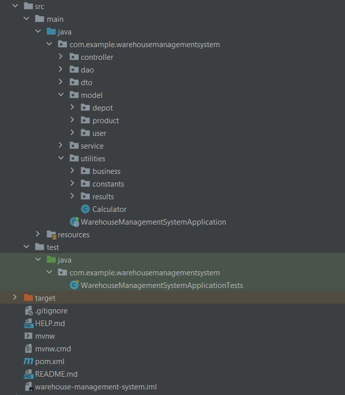

# **Simple Warehouse Management System**

REST APIs (built using Spring Boot) which provides managing depot stocks and transferring product stocks inter-depots by taking specified rules into consideration.

**TECHOLOGY STACK** 

- Java 8
- Spring Boot
- Swagger
- Apache Maven
- Spring Data JPA
- ModelMapper
- PostgreSQL
- IntelliJ IDEA

**PROJECT STRUCTURE**

**APPLICATION COMPONENTS**
- CitiesController
- DepotsController
- LocationsController
- ProductsController

**PROJECT SETUP**

- git clone https://github.com/zeynepkesim/warehouse-management-system
- run WarehouseManagementSystemApplication class

**API DOCUMENTATION**

- http://localhost:8080/swagger-ui.html#/